**HashMap源码详解**  
<!-- TOC -->

* [1. HashMap基础](#1-hashmap基础)
  + [1.1. HashMap简介](#11-hashmap简介)
  + [1.2. HashMap底层数据结构](#12-hashmap底层数据结构)
  + [1.3. 常见问题](#13-常见问题)
* [2. HashMap源码解析](#2-hashmap源码解析)
  + [2.1. HashMap继承关系](#21-hashmap继承关系)
  + [2.2. HashMap成员变量](#22-hashmap成员变量)
  + [2.3. 构造方法](#23-构造方法)

<!-- /TOC -->
参考资料  

* [HashMap详解](https://www.cnblogs.com/xinmomoyan/p/12313875.html)    
* [哔哩哔哩视频](https://www.bilibili.com/video/BV1FE411t7M7?p=9)  

# 1. HashMap基础

## 1.1. HashMap简介

HashMap基于哈希表的Map接口实现，key-value存储形式存在，不同步，线程不安全。key，value都可以为null。HashMap映射无序。

jdk1.8之前，HashMap主要由数组+链表组成。数组是HashMap的主体，链表则是为了解决哈希冲突（两个对象调用的hashCode计算的哈希值一样导致计算的数组索引值相同）而存在的。
jdk1.8之后，当链表长度大于阈值（或者红黑树的边界值，默认为8）并且当前数组的长度大于64时，此时此索引位置上的所有数据改为使用红黑树存储。  

补充：将链表转换成红黑树前会判断，即使阈值大于8，但是数组长度小于64，此时并不会将链表变为红黑树。而是选择进行数组扩容。

<center>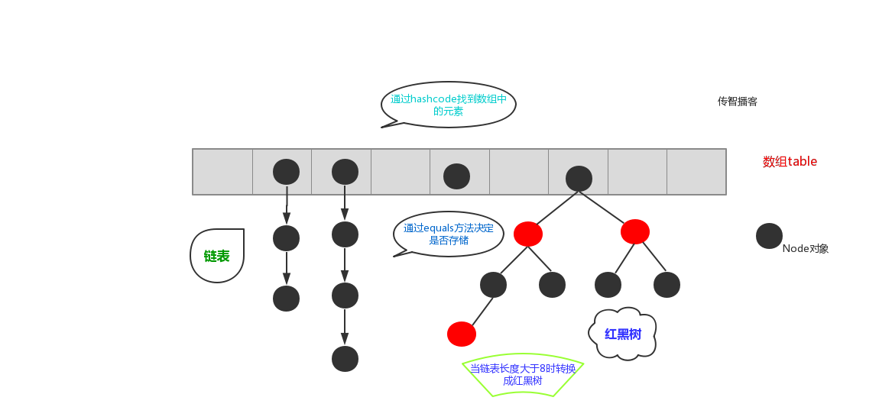</center>
<center>HashMap简介</center>

小结：

* 存取无序
* 键和值位置都可以是null，但是键位置只能一个null
* 键位置是唯一的
* jdk1.8前数据结构：数组+链表；jdk1.8后：数组+链表+红黑树
* 链表长度大于8且数组长度大于64，才能将链表转为红黑树。变红黑树的目的是为了高效的查询。

## 1.2. HashMap底层数据结构

* **JDK1.8之前，数组+链表**
* **JDK1.8之后，数组+链表+红黑树**

<center>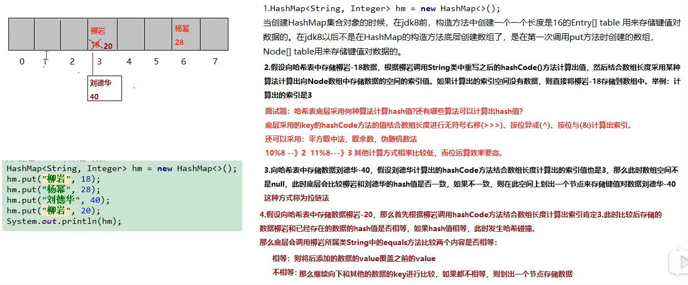</center>

## 1.3. 常见问题

1\. 哈希表底层采用何种算法计算hash值？还有哪些算法可以计算出hash值？  

【解答】
**底层采用key的hashCode方法的值结合数组长度进行无符号右移（>>>)、按位异或(^)计算hash值，按位与(&)计算出索引**。

``` java
static final int hash(Object key) {
      int h;
      return (key == null) ? 0 : (h = key.hashCode()) ^ (h >>> 16);
 }
//其中n为数组长度
(n - 1) & hash
```

还可以采用：平方取中法，取余数、伪随机数法 (效率低)。

2\. 当两个对象的hashCode相等时会怎么样？

**会产生哈希碰撞**，通过调用equals方法比较key的内容是否相同，相同则替换旧的value，不然就连接到链表后面，链表长度超过阈值8转为红黑树。

3\. 在不断的添加数据的过程中，会涉及到扩容问题，当超出临界值时扩容，默认的扩容方式为扩充为原来的2倍，并将原有的数据复制过来。

4\. jdk1\.8之后为什么引入红黑树，这样不是使结构更加复杂了吗？为什么阈值大于8转化成红黑树？

<center>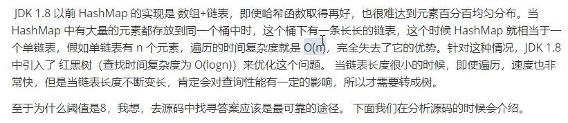</center>

<center>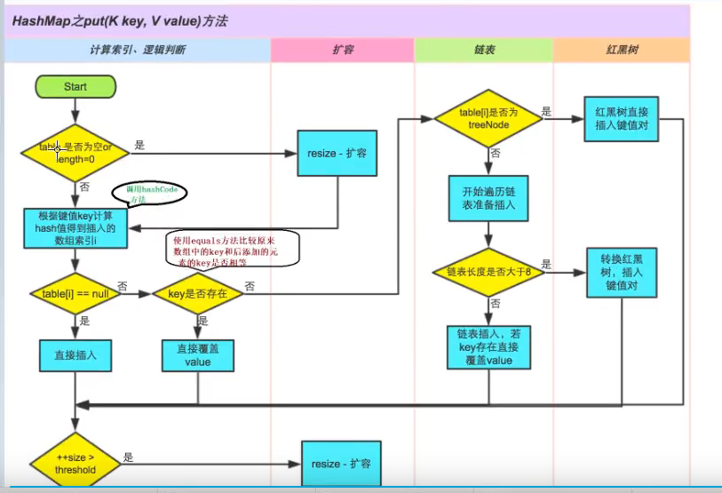</center>

【说明】

* size表示HashMap中K-V的实时数量，不是数组的长度
* threshold（临界值）=capacity（容量）*loadFactor（加载因子）。这个值是当前已占用数组长度的最大值。size超过这个临界值就重新resize（扩容），扩容后的HashMap容量是之前容量的两倍。

# 2. HashMap源码解析

## 2.1. HashMap继承关系

<center>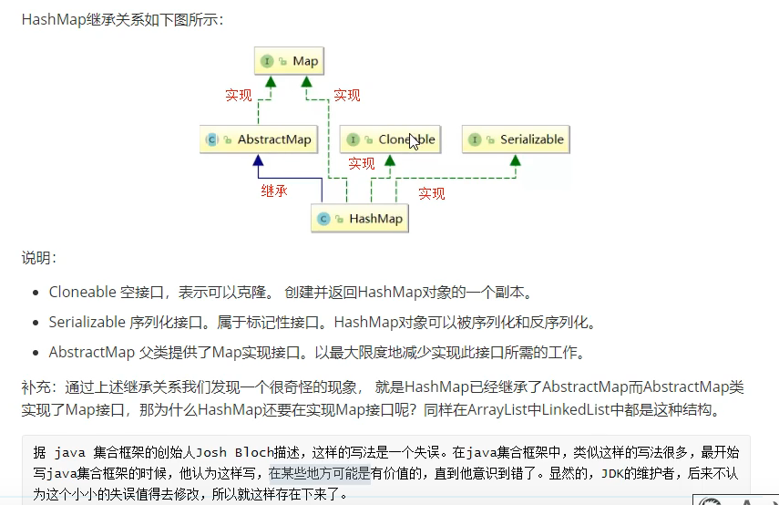</center>

``` java
public class HashMap<K,V> extends AbstractMap<K,V>
    implements Map<K,V>, Cloneable, Serializable {

    private static final long serialVersionUID = 362498820763181265L;
}
public abstract class AbstractMap<K,V> implements Map<K,V> {
    /**
     * Sole constructor.  (For invocation by subclass constructors, typically
     * implicit.)
     */
    protected AbstractMap() {
    }
}
```

## 2.2. HashMap成员变量

1\. 序列化版本号

``` java
private static final long serialVersionUID = 362498820763181265L;
```

2\. 集合的初始化容量（必须是2的n次幂）

``` java
/**
 * The default initial capacity - MUST be a power of two.
 */
static final int DEFAULT_INITIAL_CAPACITY = 1 << 4; // aka 16
```

【问题1】为什么大小必须是2的n次幂？

* 存储高效，尽量减少碰撞，在（length-1)&hash求索引的时候更均匀。

<center>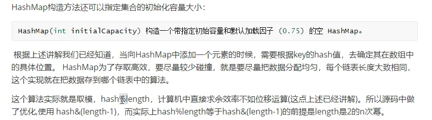</center>

<center>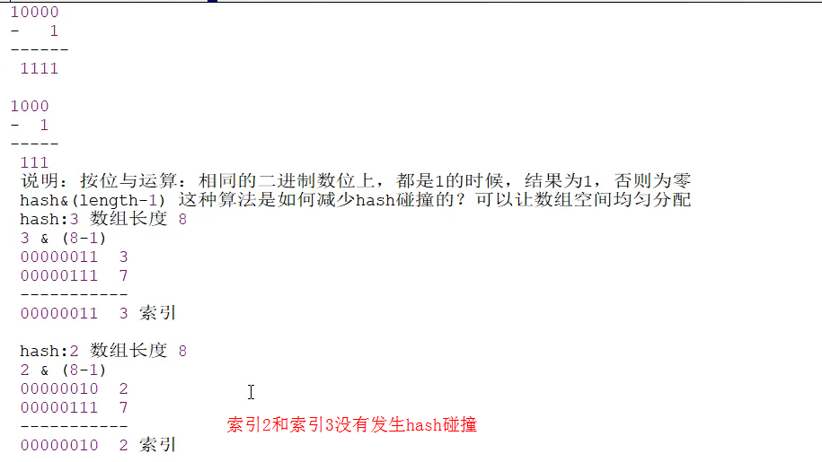</center>
<center>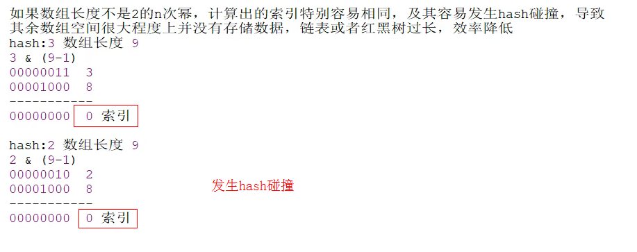</center>

<center>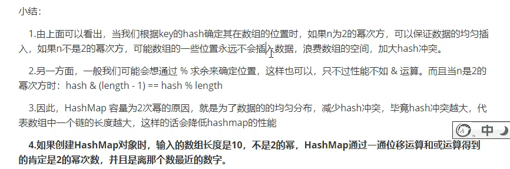</center>

【问题2】：如果传入的容量默认不是2的幂，假如是10，会怎么样呢？

【解答】
底层通过一些列的右移和或运算，把给定值变成比它大的最小的2的次数值，比如给10变成16，给17变成32。

``` java
//对传入容量进行右移位运算后进行或运算
//一共进行5次或运算，可以将当前数字中二进制最高位1的右边全部变成1，最后+1后返回
static final int tableSizeFor(int cap) {
        //这里-1的目的是使得找到的目标值大于或等于原值
        int n = cap - 1;
        n |= n >>> 1;
        n |= n >>> 2;
        n |= n >>> 4;
        n |= n >>> 8;
        n |= n >>> 16;
        return (n < 0) ? 1 : (n >= MAXIMUM_CAPACITY) ? MAXIMUM_CAPACITY : n + 1;
    }
```

<center>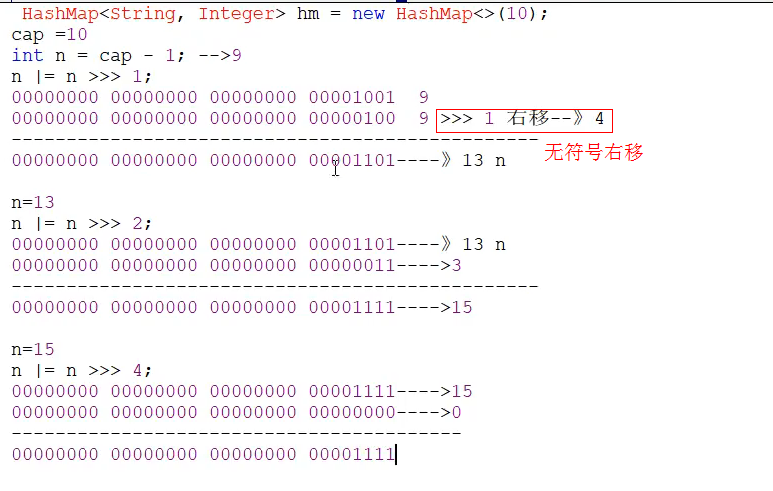</center>

完整的例子：
<center>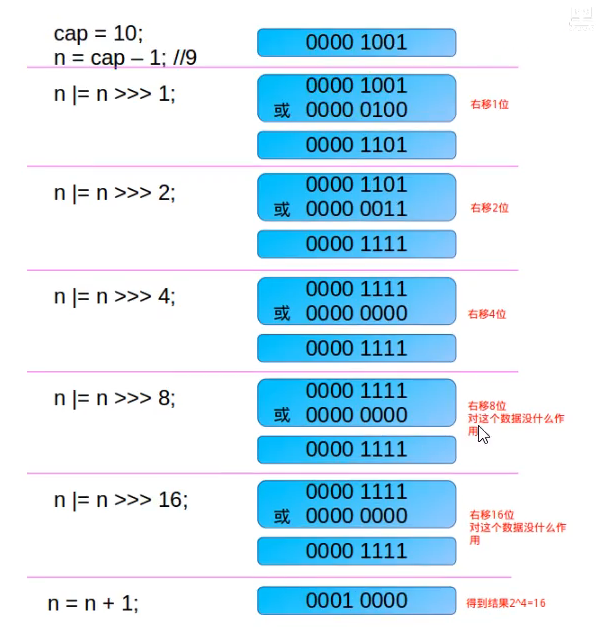</center>

<center>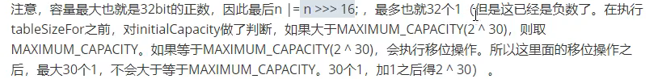</center>

``` java
public HashMap(int initialCapacity, float loadFactor) {
        if (initialCapacity < 0)
            throw new IllegalArgumentException("Illegal initial capacity: " +
                                               initialCapacity);
        if (initialCapacity > MAXIMUM_CAPACITY)
            initialCapacity = MAXIMUM_CAPACITY;
        if (loadFactor <= 0 || Float.isNaN(loadFactor))
            throw new IllegalArgumentException("Illegal load factor: " +
                                               loadFactor);
        this.loadFactor = loadFactor;
        this.threshold = tableSizeFor(initialCapacity);
    }
```

3\. 默认的负载因子

``` java
static final float DEFAULT_LOAD_FACTOR = 0.75f;
```

4\. 集合最大容量

``` java
static final int MAXIMUM_CAPACITY = 1 << 30;
```

5\. 链表转红黑树的阈值

``` java
static final int TREEIFY_THRESHOLD = 8;
```

【问题】：为什么阈值是8？  
TreeNode占用空间是普通Node的两倍，空间和时间的权衡，同时如果为8，log（8）=3小于链表的平均8/2=4。

``` java
/* Because TreeNodes are about twice the size of regular nodes, we
     * use them only when bins contain enough nodes to warrant use
     * (see TREEIFY_THRESHOLD). And when they become too small (due to
     * removal or resizing) they are converted back to plain bins.  In
     * usages with well-distributed user hashCodes, tree bins are
     * rarely used.  Ideally, under random hashCodes, the frequency of
     * nodes in bins follows a Poisson distribution
     * (http://en.wikipedia.org/wiki/Poisson_distribution) with a
     * parameter of about 0.5 on average for the default resizing
     * threshold of 0.75, although with a large variance because of
     * resizing granularity. Ignoring variance, the expected
     * occurrences of list size k are (exp(-0.5) * pow(0.5, k)

      * 0:    0.60653066
      * 1:    0.30326533
      * 2:    0.07581633
      * 3:    0.01263606
      * 4:    0.00157952
      * 5:    0.00015795
      * 6:    0.00001316
      * 7:    0.00000094
      * 8:    0.00000006

     * /
```

当hashCode离散性很好的时候，树型bin用到的概率非常小，因为数据均匀分布在每个bin中，几乎不会有bin中链表长度会达到阈值。但是在随机hashCode下，离散性可能会变差，然而JDK又不能阻止用户实现这种不好的hash算法，因此就可能导致不均匀的数据分布。不过理想情况下随机hashCode算法下所有bin中节点的分布频率会遵循泊松分布，我们可以看到，一个bin中链表长度达到8个元素的概率为0.00000006，几乎是不可能事件。所以，之所以选择8，不是拍拍屁股决定的，而是根据概率统计决定的。

* 说白了就是权衡，**空间和时间的权衡**。

红黑树的平均查找长度是log(n)，如果长度为8，平均查找长度为log(8)=3，链表的平均查找长度为n/2，当长度为8时，平均查找长度为8/2=4，这才有转换成树的必要；链表长度如果是小于等于6，6/2=3，而log(6)=2.6，虽然速度也很快的，但是转化为树结构和生成树的时间并不会太短。

6\. 红黑树转链表的阈值

``` java
static final int UNTREEIFY_THRESHOLD = 6;
```

7\. 链表转红黑树时数组的大小的阈值

链表转红黑树时数组的大小的阈值，即数组大小大于这个数字时，链表长度大于8才会转为红黑树。

``` java
static final int MIN_TREEIFY_CAPACITY = 64;
```

8\. table用来初始化数组（大小是2的n次幂）

``` java
transient Node<K,V>[] table;
```

<center>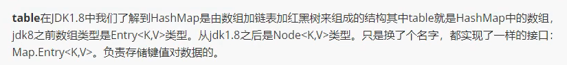</center>

9\. HashMap中存放元素的个数（重点）

``` java
transient int size;
```

10\. 临界值（如果存放元素大小大于该值，则进行扩容）

``` java
int threshold;
```

11\. 哈希表的加载因子（重点）

``` java
final float loadFactor
```

<center>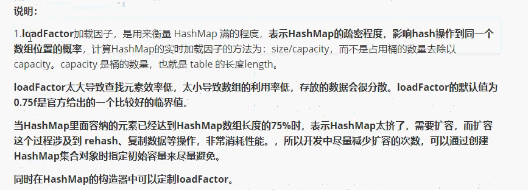</center>

概括一下：

* 提高空间利用率和 减少查询成本的折中
* 主要是泊松分布，0.75的话碰撞最小

[HashMap默认加载因子为什么选择0.75？](https://www.cnblogs.com/aspirant/p/11470928.html)

## 2.3. 构造方法
