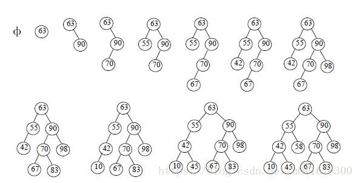

<!-- TOC -->

- [1. 二叉搜索树的原理与实现](#1-二叉搜索树的原理与实现)
    - [1.1. 基本概念](#11-基本概念)
        - [1.1.1. 定义](#111-定义)
        - [1.1.2. 结构](#112-结构)
        - [1.1.3. 特点](#113-特点)
    - [1.2. 遍历](#12-遍历)
        - [1.2.1. 前序遍历](#121-前序遍历)
    - [1.3. 实例](#13-实例)
        - [1.3.1. 创建节点](#131-创建节点)
        - [1.3.2. 创建二叉搜索树](#132-创建二叉搜索树)
        - [1.3.3. 插入节点](#133-插入节点)
        - [查找节点](#查找节点)
- [](#)

<!-- /TOC -->
# 1. 二叉搜索树的原理与实现
[Java实现二叉搜索树](https://blog.csdn.net/u011676300/article/details/80715249)
## 1.1. 基本概念
### 1.1.1. 定义
二叉排序树（Binary Sort Tree），又称二叉查找树（Binary Search Tree），亦称二叉搜索树。

### 1.1.2. 结构
二叉搜索树的建立过程． 
<div align="center"></div>

### 1.1.3. 特点
二叉排序树或者是一棵空树，或者是具有下列性质的二叉树：  
* 若左子树不空，则左子树上所有结点的值均小于或等于它的根结点的值；  
* 若右子树不空，则右子树上所有结点的值均大于或等于它的根结点的值；  
* 左、右子树也分别为二叉排序树；  

## 1.2. 遍历
### 1.2.1. 前序遍历

规则：若二叉树为空，则空操作返回，否则先访问根节点，再前序遍历左子树，再后序遍历右子树.    
遍历结果：Ａ－Ｂ－Ｄ－Ｅ－Ｃ－Ｆ－Ｇ－Ｈ 

## 1.3. 实例
### 1.3.1. 创建节点
```java
public class Node {
    //节点值
    int   val;
    //左子节点引用
    Node  leftChild;
    //右子节点引用
    Node  rightChild;

    public void  printNode() {
        System.out.println(val);
    }
}

```

### 1.3.2. 创建二叉搜索树
```java
public class BinaryTree {

    private Node root;
}
```

### 1.3.3. 插入节点
```java
/**
     * 插入节点
     */
    public void insert(int data){
        Node newNode = new Node();
        newNode.val = data;
        if(root == null){
            root = newNode;
        }else {
            Node current = root;
            Node parent;
            // 循环查找插入的位置
            while(true){
                parent = current;
                if(data < current.val){
                    current = current.leftChild;
                    // 直到当前的节点为null
                    if(current == null){
                        // 设置当前节点的父节点的左子节点为新创建的节点
                        parent.leftChild = newNode;
                        return;
                    }
                }else {
                    current = current.rightChild;
                    // 直到当前节点为null
                    if(current == null){
                        parent.rightChild = newNode;
                        return;
                    }
                }
            } // end of while(true)
        }
    }
```

### 查找节点
```java
    /**
     * 查找节点
     * 查找节点也是根据其特点进行查找，某个节点的值总比左子树的值大，比右子树的值小或者等于
     */
    public Node find(int value){
        Node current = root;
        while (current.val != value){
            if(value < current.val){
                current = current.leftChild;
            }else {
                current = current.rightChild;
            }
            if(current == null){ // 找到最后都没有找到
                return null;
            }
        }
        return current;
    }
```

##


