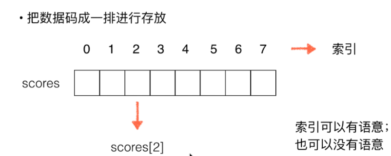
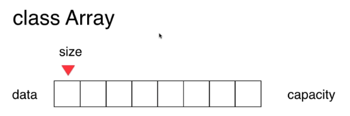
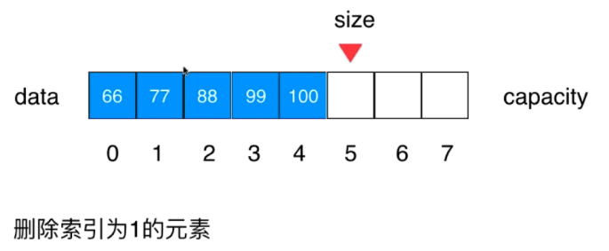
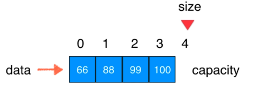
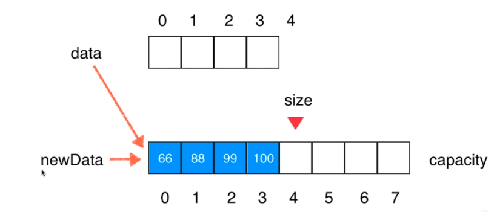
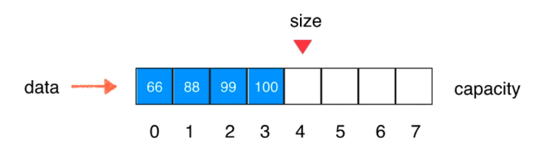

<!-- TOC -->

- [1. 数组](#1-数组)
    - [1.1. 二次封装属于自己的数组](#11-二次封装属于自己的数组)
    - [1.2. 向数组添加元素](#12-向数组添加元素)
        - [1.2.1. 向数组末尾添加元素](#121-向数组末尾添加元素)
        - [1.2.2. 向指定位置添加元素](#122-向指定位置添加元素)
    - [1.3. 数组中查询元素和修改元素](#13-数组中查询元素和修改元素)
        - [1.3.1. 查找索引为idnex的元素](#131-查找索引为idnex的元素)
        - [1.3.2. 修改index索引位置的值](#132-修改index索引位置的值)
        - [1.3.3. toString()方法](#133-tostring方法)
    - [1.4. 包含、搜索和删除](#14-包含搜索和删除)
        - [1.4.1. 包含](#141-包含)
        - [1.4.2. 搜索](#142-搜索)
        - [1.4.3. 删除指定位置的元素](#143-删除指定位置的元素)
    - [1.5. 使用泛型](#15-使用泛型)
    - [1.6. 动态数组](#16-动态数组)
        - [1.6.1. 自动扩容](#161-自动扩容)
        - [1.6.2. 自动缩容](#162-自动缩容)

<!-- /TOC -->
# 1. 数组
java数组属于静态数组。

## 1.1. 二次封装属于自己的数组
<div align="center"></div>

* 数组最大的优点：快速查询。score[2];
* 数组最好应用于"索引有语义"的情况,但并非所有有语义的索引都适合数组。比如身份证号。
<div align="center"></div>

```java
public class Array {
    // 大多数情况下，类的成员变量都是私有的，用户只能根据类（接口）的public方法获取对应的值。
    private int[] data; // capacity可以用data.length表示
    private int size;

    // 构造函数，传入数组的容量capacity构造Array
    public Array(int capacity){
        data = new int[capacity];
        size = 0;
    }

    // 无参的构造函数，默认数组的容量capacity=10
    public Array(){
        this(10);
    }

    // 数组中元素的个数
    public int getSize(){
        return size;
    }

    // 数组的容量
    public int getCapacity(){
        return data.length;
    }

    public boolean isEmpty(){
        return size == 0;
    }
}
```

## 1.2. 向数组添加元素

### 1.2.1. 向数组末尾添加元素
<div align="center"></div>

```java
// 向所有元素后添加一个新元素
    public void addLast(int e){
        if(size == data.length){
            throw new IllegalArgumentException("addLast failed,Array is full");
        }
        data[size] = e;
        size ++;
    }
```

### 1.2.2. 向指定位置添加元素
<div align="center"></div>

```java
// 向数组中任意一个位置插入一个元素e
    public void add(int index, int e){
        if(size == data.length){
            throw new IllegalArgumentException("Add failed,Array is full");
        }
        if(index < 0 || index > size){
            throw new IllegalArgumentException("add failed,Require index>=0 and index < size");
        }

        for(int i=size-1;i>=index;i--){
            data[i+1] = data[i]; // 每个元素向后移一位
        }
        data[index] = e;
        size ++;
    }
```

拓展：
1. addLast可以简化为
```java
// 向所有元素后添加一个新元素
    public void addLast(int e){
        add(size,e);
    }
```

2. 在所有元素前添加一个元素
```java
    public void addFirst(int e){
        add(0,e);
    }
```

## 1.3. 数组中查询元素和修改元素
### 1.3.1. 查找索引为idnex的元素
```java
// 获取指定index索引位置的值
    int get(int index) {
        if (index < 0 || index > size) {
            throw new IllegalArgumentException("Get failed. Index is illegal");
        }
        return data[index];
    }
```

### 1.3.2. 修改index索引位置的值
```java
// 修改index索引位置的值
    void set(int index, int e) {
        if (index < 0 || index > size) {
            throw new IllegalArgumentException("Set failed. Index is illegal");
        }
        data[index] = e;
    }
```

### 1.3.3. toString()方法

```java
    @Override
    public String toString() {
        StringBuffer res = new StringBuffer();
        res.append(String.format("Array:size = %d , capacity = %d\n", size, data.length));
        res.append("[");
        for (int i = 0; i < size; i++) {
            res.append(data[i]);
            if (i != size - 1) {
                res.append(", ");
            }
        }
        res.append("]");
        return res.toString();
    }
```

## 1.4. 包含、搜索和删除

### 1.4.1. 包含
contains(int e)
```java
// 判断是否包含某个元素
    public boolean contains(int e) {
        for (int i = 0; i < size; i++) {
            if (data[i] == e)
                return true;
        }
        return false;
    }
```

### 1.4.2. 搜索
find(int e)
```java
    // 在数组中查找元素e的索引，如果元素不存在，则返回-1
    public int find(int e) {
        for (int i = 0; i < size; i++) {
            if (data[i] == e)
                return i;
        }
        return -1;
    }
```

### 1.4.3. 删除指定位置的元素
<div align="center"></div>

```java
    // 从数组中删除index位置的元素，范回删除的元素
    public int remove(int index) {
        if (index < 0 || index > size)
            throw new IllegalArgumentException("Remove failed. Index is illegal");

        int ret = data[index]; // 被删除的元素
        for (int i = index + 1; i < size; i++) {
            data[i - 1] = data[i];
        }
        size --;
        return ret;
    }

    // 删除第一个元素，返回删除的值
    public int removeFirst() {
        return remove(0);
    }

    // 删除最后一个元素，返回删除的值
    public int removeLast() {
        return remove(size - 1);
    }

    // 从数组中删除元素e
    public void removeElement(int e){
        int index = find(e); // 查找该元素，不存在则返回-1
        if(index != -1){
            remove(index);
        }
    }
```

## 1.5. 使用泛型
**泛型**  
让数组可以存放“任何”数据类型

* 不可以是基本数据类型，只能是类对象
boolean、byte、char、short、int、long、float、double

* 每个数据类型都有对应的包装类
Boolean、Byte、Char、Short、Int、Long、Float、Double

* 除此之外，泛型还能存放自定义的类型，如：Student、User等

```java
/**
 * @Author: eastlong
 * @Date 2020/3/7
 * @function: E代表Element，泛型，可以指Boolean、Byte、Char、Short、Int、Long、Float、Double
 * E也可以承载自定义的类型，如User、Student
 **/
public class ArrayE<E> {
    // 大多数情况下，类的成员变量都是私有的，用户只能根据类（接口）的public方法获取对应的值。
    private E[] data; // capacity可以用data.length表示
    private int size;

    // 构造函数，传入数组的容量capacity构造Array
    public ArrayE(int capacity) {
        data = (E[]) new Object[capacity];
        size = 0;
    }

    // 无参的构造函数，默认数组的容量capacity=10
    public ArrayE() {
        this(10);
    }

    // 数组中元素的个数
    public int getSize() {
        return size;
    }

    // 数组的容量
    public int getCapacity() {
        return data.length;
    }

    public boolean isEmpty() {
        return size == 0;
    }

    // 向数组中任意一个位置插入一个元素e
    public void add(int index, E e) {
        if(index < 0 || index > size)
            throw new IllegalArgumentException("Add failed,Require index >=0 and index < size");

        // 数组已满，自动扩容
        if (size == data.length)
            resize(2 * data.length);

        for (int i = size - 1; i >= index; i--) {
            data[i + 1] = data[i]; // 每个元素向后移一位
        }

        data[index] = e;
        size++;
    }

    // 向所有元素后添加一个新元素
    public void addLast(E e) {
        /**
         if(size == data.length){
         throw new IllegalArgumentException("AddLast failed,Array is full");
         }
         data[size] = e;
         size ++;
         */
        add(size, e);
    }

    // 在所有元素前添加一个元素
    public void addFirst(E e) {
        add(0, e);
    }

    // 获取指定index索引位置的值
    public E get(int index) {
        if (index < 0 || index > size) {
            throw new IllegalArgumentException("Get failed. Index is illegal");
        }
        return data[index];
    }

    public E getLast(){
        return get(size - 1);
    }

    public E getFirst(){
        return get(0);
    }

    // 修改index索引位置的值
    void set(int index, E e) {
        if (index < 0 || index > size) {
            throw new IllegalArgumentException("Set failed. Index is illegal");
        }
        data[index] = e;
    }

    // 判断是否包含某个元素
    public boolean contains(E e) {
        for (int i = 0; i < size; i++) {
            if (data[i].equals(e))
                return true;
        }
        return false;
    }

    // 在数组中查找元素e的索引，如果元素不存在，则返回-1
    public int find(E e) {
        for (int i = 0; i < size; i++) {
            if (data[i].equals(e))
                return i;
        }
        return -1;
    }

    // 从数组中删除index位置的元素，范回删除的元素
    public E remove(int index) {
        if (index < 0 || index > size)
            throw new IllegalArgumentException("Remove failed. Index is illegal");

        E ret = data[index]; // 被删除的元素
        for (int i = index + 1; i < size; i++) {
            data[i - 1] = data[i];
        }
        size--;
        data[size] = null; // loitering object != memory leak

        // 缩容
        if(size == data.length / 2)
            resize(data.length/2);
        return ret;
    }

    // 删除第一个元素，返回删除的值
    public E removeFirst() {
        return remove(0);
    }

    // 删除最后一个元素，返回删除的值
    public E removeLast() {
        return remove(size - 1);
    }

    // 从数组中删除元素e
    public void removeElement(E e) {
        int index = find(e); // 查找该元素，不存在则返回-1
        if (index != -1) {
            remove(index);
        }
    }


    @Override
    public String toString() {
        StringBuffer res = new StringBuffer();
        res.append(String.format("Array:size = %d , capacity = %d\n", size, data.length));
        res.append("[");
        for (int i = 0; i < size; i++) {
            res.append(data[i]);
            if (i != size - 1) {
                res.append(", ");
            }
        }
        res.append("]");
        return res.toString();
    }

    // 自动将数组扩容2倍
    private void resize(int newCapacity){
        E[] newData = (E[]) new Object[newCapacity];
        for(int i=0;i<size;i++){
            newData[i] = data[i];
        }
        data = newData;
    }


}
```

## 1.6. 动态数组
<div align="center"></div>


<div align="center"></div>

<div align="center"></div>

思路：当数组满了的时候，对数组进行扩容；当数组过少，自动缩容
resize

### 1.6.1. 自动扩容

```java
    // 向数组中任意一个位置插入一个元素e
    public void add(int index, E e) {
        if (size == data.length)
            throw new IllegalArgumentException("Add failed,Array is full");
        // 数组已满，自动扩容
        if (size == data.length)
            resize(2 * data.length);

        for (int i = size - 1; i >= index; i--) {
            data[i + 1] = data[i]; // 每个元素向后移一位
        }
        
        data[index] = e;
        size++;
    }

    // 自动将数组扩容2倍
    private void resize(int newCapacity){
        E[] newData = (E[]) new Object[newCapacity];
        for(int i=0;i<size;i++){
            newData[i] = data[i];
        }
        data = newData;
    }    
```

### 1.6.2. 自动缩容
```java
    // 从数组中删除index位置的元素，范回删除的元素
    public E remove(int index) {
        if (index < 0 || index > size)
            throw new IllegalArgumentException("Remove failed. Index is illegal");

        E ret = data[index]; // 被删除的元素
        for (int i = index + 1; i < size; i++) {
            data[i - 1] = data[i];
        }
        size--;
        data[size] = null; // loitering object != memory leak

        // 缩容
        if(size == data.length / 2)
            resize(data.length/2);
        return ret;
    }
```


