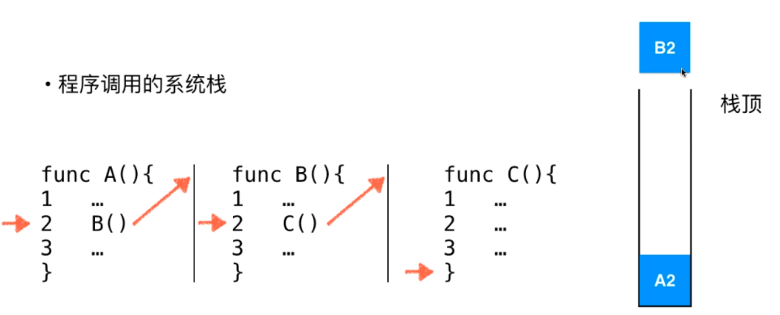
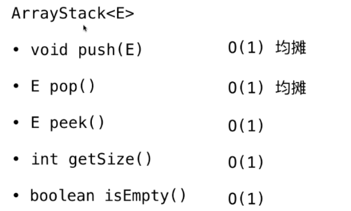
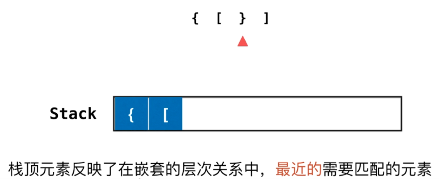
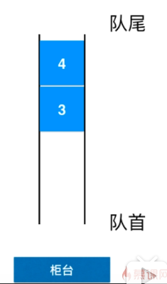
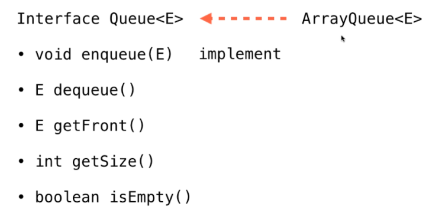
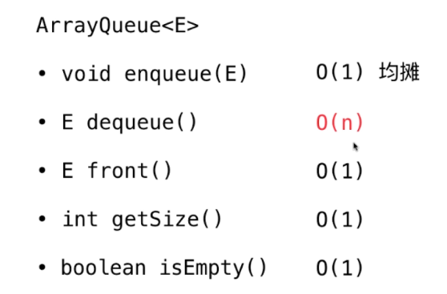

<!-- TOC -->

- [栈](#栈)
    - [栈基础知识](#栈基础知识)
        - [栈的特点](#栈的特点)
        - [栈的应用](#栈的应用)
        - [栈的实现](#栈的实现)
        - [栈的复杂度分析](#栈的复杂度分析)
    - [栈的另外一个应用：括号匹配](#栈的另外一个应用括号匹配)
- [队列](#队列)
    - [数组队列](#数组队列)
        - [对列的特点](#对列的特点)
        - [复杂度分析](#复杂度分析)

<!-- /TOC -->
# 栈
## 栈基础知识
### 栈的特点
1. 栈也是一种线性数据结构
2. 相比数组，栈对应的操作是数组的子集
3. 只能从一端添加元素，也只能从一端取出元素
<div align="center"></div>

* 栈是一种**后进先出**的数据结构
* Last In First Out(LIFO)

### 栈的应用
1. 无处不在的Undo操作（撤销）
2. 程序调用的系统栈
<div align="center"></div>

### 栈的实现
Stack<E>
* void push(E) --入栈
* E pop() -- 出栈
* E peek() -- 栈顶
* int getSize() --栈的大小
* boolean isEmpty() -- 栈是否为空


对用户而言，支持这些操作就好，具体的底层实现并不关心，实际底层有多种实现方法

<div align="center"></div>

1. Stack接口
```java
public interface Stack<E> {
    int getSize();
    boolean isEmpty();
    void push(E e);
    E pop();
    E peek();
}
```

2. ArrayStack
```java
public class ArrayStack<E> implements Stack<E> {
    ArrayE<E> array;

    public ArrayStack(int capacity){
        array = new ArrayE<>(capacity);
    }

    public ArrayStack(){
        array = new ArrayE<>();
    }


    @Override
    public int getSize() {
        return array.getSize();
    }

    @Override
    public boolean isEmpty() {
        return array.isEmpty();
    }

    // 特有的方法
    public int getCapacity(){
        return array.getCapacity();
    }

    @Override
    public void push(E e) {
        array.addLast(e); // 栈从数组末尾添加元素
    }

    @Override
    public E pop() {
        return array.removeLast(); // removeLast()方法有返回值
    }

    @Override
    public E peek() {
        return array.getLast(); // peek() 栈顶是数组最后一个元素
    }

    @Override
    public String toString(){
        StringBuilder res = new StringBuilder();
        res.append("Stack: ");
        res.append("[");
        for(int i = 0;i<array.getSize();i++){
            res.append(array.get(i));
            if(i!= array.getSize() -1)
                res.append(", ");
        }
        res.append("] top");// 代表右侧是栈顶
        return res.toString();
    }
}
```

3. 测试类
```java
public class Main {
    public static void main(String[] args) {
        ArrayStack<Integer> stack = new ArrayStack<>();
        for (int i = 0; i < 5; i++) {
            stack.push(i);
            System.out.println(stack);
        }

        stack.pop();
        System.out.println(stack);
    }
}
```


3. 前期添加

```java
    public E getLast(){
        return get(size - 1);
    }

    public E getFirst(){
        return get(0);
    }
```

### 栈的复杂度分析
<div align="center"></div>

## 栈的另外一个应用：括号匹配
<div align="center"></div>

leetcode20: valid parentheses
```java
public class Solution {
    public boolean isValid(String s){
        Stack<Character> stack = new Stack<>();

        for(int i=0;i<s.length();i++){
            char c = s.charAt(i);
            if(c=='(' || c=='[' || c=='{'){
                stack.push(c);
            }else {
                if(stack.isEmpty())
                    return false;

                char topChar = stack.pop();
                if(c==')' && topChar!='(')
                    return false;
                if(c==']' && topChar != ']')
                    return false;
                if(c=='}' && topChar !='}')
                    return false;
            }
        }
        return stack.isEmpty(); // 最后需要判断栈是否为空
    }
}
```

# 队列
## 数组队列
### 对列的特点
* 队列也是一种线性结构
* 相比数组，队列对应的操作是数组的子集
* 只能从一端（队尾）添加元素，只能从另一端（队首）取出元素（食堂队伍排队）

* 对列是一种**先进先出**的数据结构（先到先得）

* First In First Out(FIFO)
<div align="center"></div>


1. Queue 接口
<div align="center"></div>

```java
public interface Queue<E> {
    int getSize();

    boolean isEmpty();

    void enqueue(E e);

    E dequeue();

    E front();
}
```

2. ArrayQueue实现
```java
public class ArrayQueue<E> implements Queue<E> {

    private ArrayE<E> array;

    public ArrayQueue(int capacity){
        array = new ArrayE<>(capacity);
    }

    public ArrayQueue(){
        array = new ArrayE<>();
    }

    @Override
    public int getSize() {
        return array.getSize();
    }

    @Override
    public boolean isEmpty() {
        return array.isEmpty();
    }
    
    public int getCapacity(){
        return array.getCapacity();
    }

    @Override
    public void enqueue(E e) { // 入队操作
        array.addLast(e);
    }

    @Override
    public E dequeue() {
        return array.removeFirst(); // 后进先出
    }

    @Override
    public E front() {
        return array.getFirst();// 后进先出
    }

    @Override
    public String toString(){
        StringBuilder res = new StringBuilder();
        res.append("Queue: ");
        res.append("front [");
        for(int i = 0;i<array.getSize();i++){
            res.append(array.get(i));
            if(i!= array.getSize() -1)
                res.append(", ");
        }
        res.append("] tail");// 代表右侧是栈顶
        return res.toString();
    }


    public static void main(String[] args) {
        ArrayQueue<Integer> queue = new ArrayQueue<>();
        for(int i = 0;i<10;i++){
            queue.enqueue(i);
            System.out.println(queue);

            if(i%3 == 2){
                queue.dequeue();
                System.out.println(queue);
            }
        }
    }
}
```

### 复杂度分析

<div align="center"></div>

dequeue() 复杂度为O(n) 是因为元素出队后，剩下的元素都要向前移动一位。


