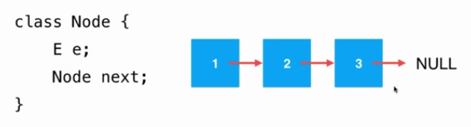
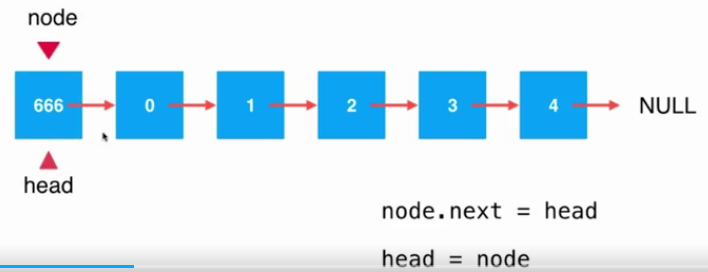
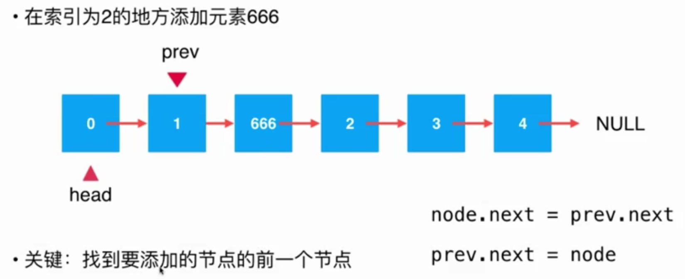
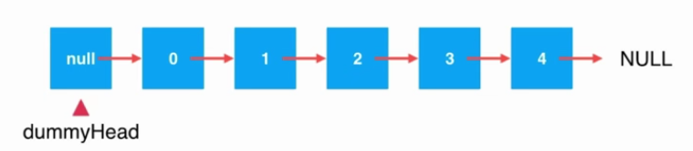
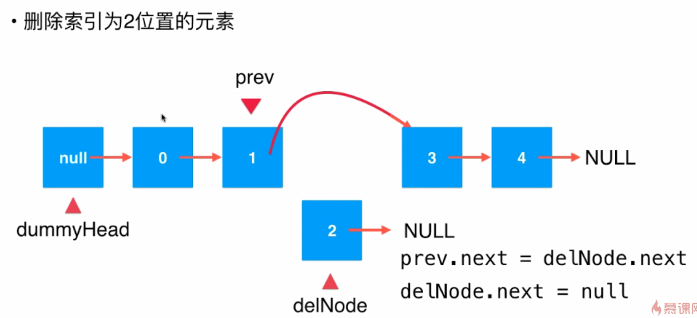
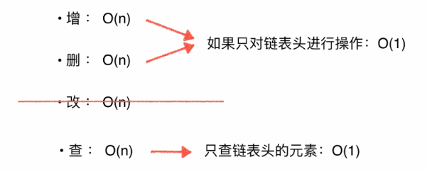
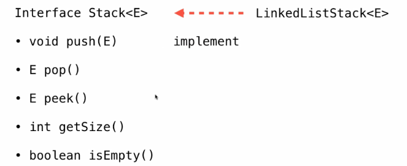
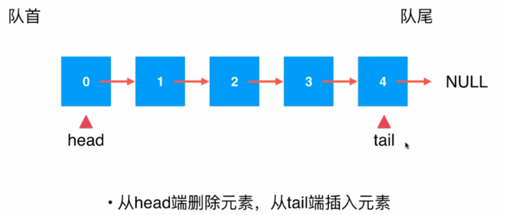

<!-- TOC -->

- [1. 链表](#1-链表)
    - [1.1. 什么是链表](#11-什么是链表)
        - [1.1.1. 为什么链表很重要](#111-为什么链表很重要)
        - [1.1.2. 链表Linked List](#112-链表linked-list)
        - [1.1.3. 数组和链表的对比](#113-数组和链表的对比)
        - [1.1.4. 链表的程序](#114-链表的程序)
    - [1.2. 向链表中添加元素](#12-向链表中添加元素)
        - [1.2.1. 在表头添加元素](#121-在表头添加元素)
    - [1.3. 在索引为2地方添加元素 666](#13-在索引为2地方添加元素-666)
        - [1.3.1. 在链表末尾添加元素](#131-在链表末尾添加元素)
    - [1.4. 为链表设立虚拟头结点](#14-为链表设立虚拟头结点)
    - [1.5. 链表的遍历、查询和修改](#15-链表的遍历查询和修改)
        - [1.5.1. 获取索引为index的元素](#151-获取索引为index的元素)
        - [1.5.2. 修改链表第index(0-based)位置的元素](#152-修改链表第index0-based位置的元素)
        - [1.5.3. 查询链表中是否有元素e](#153-查询链表中是否有元素e)
        - [1.5.4. 验证](#154-验证)
    - [1.6. 链表的删除](#16-链表的删除)
        - [1.6.1. 删除索引为2的结点](#161-删除索引为2的结点)
    - [1.7. 链表的复杂度分析](#17-链表的复杂度分析)
    - [1.8. 使用链表实现栈](#18-使用链表实现栈)
    - [1.9. 链表实现队列](#19-链表实现队列)

<!-- /TOC -->

# 1. 链表
## 1.1. 什么是链表
### 1.1.1. 为什么链表很重要
* 链表 **真正的动态数据结构**

* 最简单的动态数据结构
* 更深入的理解**引用**（或者指针）
* 更深入理解**递归**
* 辅助其他数据结构

### 1.1.2. 链表Linked List
* 数据存储在节点（Node）中

<div align="center"></div>

* 优点：真正的动态，不需要处理固定容量的问题
* 缺点：丧失了随机访问的能力

### 1.1.3. 数组和链表的对比
* 数组
    - 数组最好用于有索引语意的情况。scores[2]
    - 最大优点：支持快速查询

* 链表
    - 链表不适合用于索引有语意的情况
    - 最大的优点：动态

### 1.1.4. 链表的程序
```java
/**
 * @Author: eastlong
 * @Date 2020/3/14
 * @function:
 **/
public class LinkedList<E> {
    // 设计成私有的内部类
    private class Node{
        public E e;
        public Node next;

        public Node(E e,Node next){
            this.e = e;
            this.next = next;
        }

        public Node(E e){
            this(e,null);
        }

        public Node(){
            this(null, null);
        }
    }
}
```

## 1.2. 向链表中添加元素
### 1.2.1. 在表头添加元素
<div align="center"></div>

```java
    // 在链表头添加新的元素e
    public void addFirst(E e){
        Node node = new Node(e);
        node.next = head;
        head = node;

        // head = new Node(e,head); // 上述三个步骤可以浓缩为一句代码

        size ++; // 维护size
    }
```

## 1.3. 在索引为2地方添加元素 666 
<div align="center"></div>

```java
    // 在index为2的位置添加新的元素e
    // 在链表操作中不是一个常用的操作，练习用
    public void add(int index, E e) {
        if (index < 0 || index > size)
            throw new IllegalArgumentException("Add failed,Illegal index.");

        if (index == 0) {
            addFirst(e);
        }else {
            Node prev = head;
            for(int i = 0; i < index -1; i ++){
                prev = prev.next; // prev 右移动
            }

            Node node = new Node(e);
            node.next = prev.next;
            prev.next = node;

            // 上述三个步骤可以浓缩为一句代码
            prev.next = new Node(e,prev.next);

            size ++;
        }
    }
```

### 1.3.1. 在链表末尾添加元素
```java
    // 在链表的末尾添加元素
    public void addLast(E e){
        add(size,e);
    }
```

## 1.4. 为链表设立虚拟头结点
<div align="center"></div>

代码做如下修改
```java
package com.betop.datastruct.链表;

/**
 * @Author: eastlong
 * @Date 2020/3/14
 * @function:
 **/
public class LinkedList<E> {
    // 设计成私有的内部类
    private class Node {
        public E e;
        public Node next;

        public Node(E e, Node next) {
            this.e = e;
            this.next = next;
        }

        public Node(E e) {
            this(e, null);
        }

        public Node() {
            this(null, null);
        }

        public String toString() {
            return e.toString();
        }
    }

    private Node dummyHead;
    private int size;

    public LinkedList() {
        dummyHead = new Node(null, null);// 虚拟头结点
        size = 0;
    }

    // 获取链表的中元素的个数
    public int getSize() {
        return size;
    }

    // 返回链表是否为空
    public boolean isEmpty() {
        return size == 0;
    }

    // 在index为2的位置添加新的元素e
    // 在链表操作中不是一个常用的操作，练习用
    public void add(int index, E e) {
        if (index < 0 || index > size)
            throw new IllegalArgumentException("Add failed,Illegal index.");

        Node prev = dummyHead;
        for (int i = 0; i < index; i++)  // 从dummyHead开始遍历，遍历index次
            prev = prev.next; // prev 右移动

//        Node node = new Node(e);
//        node.next = prev.next;
//        prev.next = node;
        // 上述三个步骤可以浓缩为一句代码
        prev.next = new Node(e, prev.next);
        size++;

    }

    // 在链表头添加新的元素e
    public void addFirst(E e) {
        add(0, e);
    }

    // 在链表的末尾添加元素
    public void addLast(E e) {
        add(size, e);
    }

}
```

【总结】虚拟头结点的引入，使得代码更加简洁高效。

## 1.5. 链表的遍历、查询和修改

### 1.5.1. 获取索引为index的元素
```java
    // 获得链表第index(0-based)位置的元素
    // 在链表操作中不是一个常用的操作，练习用
    public E get(int index){
        if(index < 0 || index > size)
            throw new IllegalArgumentException("Add failed,Illegal index.");

        Node cur = dummyHead.next; // 从0开始
        for(int i=0; i< index;i++)
            cur = cur.next;
        return cur.e;
    }
```

### 1.5.2. 修改链表第index(0-based)位置的元素
```java
    // 修改链表第index(0-based)位置的元素
    // 在链表操作中不是一个常用的操作，练习用
    public void set(int index,E e){
        if(index < 0 || index > size)
            throw new IllegalArgumentException("Set failed,Illegal index.");

        Node cur = dummyHead.next;
        for(int i=0;i<index;i++) // 遍历index次
            cur = cur.next;
        cur.e = e;
    }
```

### 1.5.3. 查询链表中是否有元素e
```java
    // 查询链表中是否有元素e
    public boolean contains(E e){
        Node cur = dummyHead.next;
        while (cur != null) { // 表示当前结点是有效结点
            if(cur.e.equals(e))
                return true;
            cur = cur.next;
        }

        return false;
    }
```

### 1.5.4. 验证
```java
    @Override
    public String toString() {
        StringBuilder res = new StringBuilder();

        Node cur = dummyHead.next;
        while (cur != null) {
            res.append(cur + "->");
            cur = cur.next;
        }
        res.append("NULL");

        return res.toString();
    }
```

测试
```java
/**
 * @Author: eastlong
 * @Date 2020/3/14
 * @function:
 **/
public class Main {
    public static void main(String[] args) {
        LinkedList<Integer> linkedList = new LinkedList<>();
        for (int i = 0; i < 5; i++) {
            linkedList.addFirst(i);
            System.out.println(linkedList);
        }

        linkedList.add(2, 666);
        System.out.println(linkedList);
    }
}
```

## 1.6. 链表的删除
### 1.6.1. 删除索引为2的结点
<div align="center"></div>

```java
    // 删除链表索引为index(0-based)位置的元素，返回删除的元素
    // 在链表操作中不是一个常用的操作，练习用
    public E remove(int index) {
        if (index < 0 || index >= size)
            throw new IllegalArgumentException("remove failed,Illegal index.");

        Node pre = dummyHead; // 要找到被删除元素的前一个元素，因此从dummyHead开始
        for (int i = 0; i < index; i++)
            pre = pre.next;

        Node retNode = pre.next;// 被删除的元素
        pre.next = retNode.next;
        retNode.next = null;
        size --;

        return retNode.e;
    }

    // 删除第一个元素
    public E removeFirst() {
        return remove(0);
    }

    // 删除最后一个元素
    public E removeLast() {
        return remove(size - 1);
    }
```

## 1.7. 链表的复杂度分析
* 添加操作
    * addLast(e)   O(n)
    * addFirst(e)  O(n)
    * add(index,e) O(n/2)=O(n)

* 删除操作
    * removeLast(e) O(n)
    * removeFirst(e) O(1)
    * remove(index,e) O(n/2)=O(n)

* 修改操作
    * set(index,e) O(n)

* 查找操作
    * get(index) O(n)
    * contains(e) O(n)

* 总结


<div align="center"></div>

## 1.8. 使用链表实现栈
<div align="center"></div>

## 1.9. 链表实现队列


<div align="center"></div>

```java
package com.betop.datastruct.链表;

import com.betop.datastruct.队列.Queue;

/**
 * @Author: eastlong
 * @Date 2020/3/15
 * @function: 链表实现队列
 **/
public class LinkedListQueue<E> implements Queue<E> {
    // 设计成私有的内部类
    private class Node {
        public E e;
        public Node next;

        public Node(E e, Node next) {
            this.e = e;
            this.next = next;
        }

        public Node(E e) {
            this(e, null);
        }

        public Node() {
            this(null, null);
        }

        public String toString() {
            return e.toString();
        }
    }

    private Node head,tail;
    private int size;

    public LinkedListQueue(){
        head = null;
        tail = null;
        size = 0;
    }

    @Override
    public int getSize() {
        return size;
    }

    @Override
    public boolean isEmpty() {
        return size == 0;
    }

    @Override
    public void enqueue(E e) { // 入队，从队尾插入
        if(tail == null){ // 空队列
            tail = new Node(e);
            head = tail;
        }
        else {
            tail.next = new Node(e);
            tail = tail.next;
        }
        size ++;
    }

    @Override
    public E dequeue() { //出队操作，队列从队首出队
        if(isEmpty())
            throw new IllegalArgumentException("Cannot dequeue from an empty queue.");

        Node retNode = head;
        head = head.next;
        retNode.next = null;
        if(head == null) // 如果head为null，则tail为null；否则没有变化
            tail = null;
        size --;

        return retNode.e;
    }

    @Override
    public E front() {
        if(isEmpty()){
            throw new IllegalArgumentException("Queue is empty.");
        }
        return null;
    }

    @Override
    public String toString(){
        StringBuilder res = new StringBuilder();
        res.append("Queue front:");

        Node cur = head;
        while (cur != null){
            res.append(cur + "->");
            cur = cur.next;
        }

        res.append("NULL tail");
        return res.toString();
    }


    public static void main(String[] args) {
        LinkedListQueue<Integer> queue = new LinkedListQueue<>();
        for(int i=0;i<10;i++){
            queue.enqueue(i);
            System.out.println(queue);

            if(i%3==2){
                queue.dequeue();
                System.out.println(queue);
            }
        }
    }
}

```